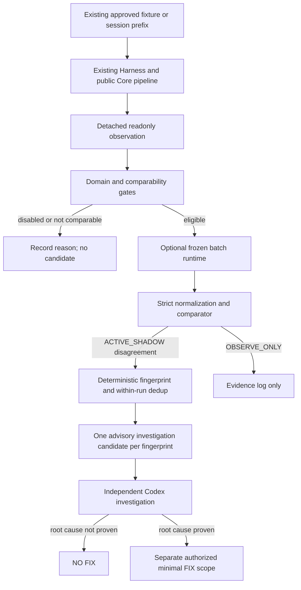

# AI Copilot Semantic Scout — architectural design

Date: 2026-10-04. Status: **SPEC_READY_FOR_USER_REVIEW**.

This document records the approved proposed architecture plus the required disagreement deduplication addition. Authorization covers this spec only. No Skill, runtime, dependencies, tests, Harness changes or implementation plan are created in this step. The spec is saved for review without staging, committing or pushing; the research HEAD is preserved.

## 1. Purpose, authority and non-goals

`ai-copilot-semantic-scout` supplies optional independent DEV/QA observations from `RefalMachine/RuadaptQwen3-4B-Instruct`. It may draw attention to suspicious semantic disagreements. It never establishes which side is correct.

Evidence priority remains current verified code → existing tests → real session/call logs → project docs → Scout output. Existing tests/oracles remain authoritative for QA; a proposed change to their product meaning requires user review. Model agreement is not proof that Core is correct, and disagreement is not proof of a bug.

The Scout is not a production engine, oracle, general judge, automatic bug detector or automatic fixer. It cannot change gold, expected assertions, snapshots, `ConversationState`, recommendation logic or business taxonomy. It introduces no parallel acceptance system, embeddings, vector database, service, daemon or production dependency. No merge, deployment or infrastructure changes are part of this design.

## 2. Verified context and evidence boundary

Authoritative research checkout: `C:/Users/EliteSochi/Documents/Codex/worktrees/spike-semantic-shadow-judge`; branch `spike/semantic-shadow-judge`; source HEAD `b9e70325db4ecfcc76f466d04e296fe291abc143`. At discovery the tracked tree had no changes; existing untracked research diagnostic directories were expected and preserved. The dirty QA worktree is a different checkout and must remain untouched. Remote main was not substituted for this local source.

Existing research reports show Gold185 169/185 (91.35%), Natural15 13/15 (86.67%, LOW_COVERAGE), Curated44 40/44 (90.91%, LOW_COVERAGE), and constructed Stress120 112/120 (93.33%, NOT_HOLDOUT). Stress DP-UNKNOWN was 15/20 (75%) and failed its gate. These results justify an advisory scope with financial certainty excluded; they do not certify production truth or general reliability. They are historical frozen inference results, not new inference or fresh test results in this design task.

The repository contains Original and Expanded DEV regression harnesses and an existing call replay. No existing `.agents/skills` directory or generic Scout observer was found. Superpowers supplies the spec convention `docs/superpowers/specs/YYYY-MM-DD-<topic>-design.md`; the repository already uses `docs/superpowers/plans`.

## 3. Integration choice and non-impact

Recommended: add a small optional readonly observation export to the existing Original and Expanded harnesses in a later authorized implementation. It captures their actual executed context and outputs rather than creating a second replay engine. Default runs do not activate the export. The alternative, an independent sidecar replay runner, avoids touching Harness but duplicates its private replay/context construction and risks comparing different execution paths; it is not selected.

Proposed integration points are `runMassRegressionBaseline` / private `pipeline` and `runExpandedRegression` / private `replay`. Both currently execute through the public `localAnalysisEngine.advanceLocalConversation` and `buildLocalAnalysisResponse`. The wrapper must not be bypassed by calling the legacy engine directly. The observer exports detached serialized values, never mutable references to live state.

The export is local and synchronous; it performs no model inference, network access or GPU initialization. Optional export errors are isolated and recorded as Scout errors, without changing deterministic results. Existing Harness reports, assertions, failure clusters and fingerprints remain unchanged with the observer off or on. Scout comparison runs separately after the normal DEV/QA verification, under the same task/run evidence namespace. `npm run verify` and CI do not invoke or await Scout.

Activation requires a DEV/QA task that explicitly selects semantic scouting and an approved input/runtime scope. Discovering or loading the Skill does not activate export, transfer conversation data, allocate compute or start investigation. Ordinary QA remains valid when Scout is not selected. A run with no eligible comparable inputs records SKIP with the selection reasons.

## 4. Readonly observation and input selection contract

An observation identifies the Harness run, non-personal observation/case id, source group, variation, exact observed turn cutoff, atomic question/contract id and applicable existing domain/slice policy. Local provenance records source HEAD, fixture/source reference, source hashes and the Core execution path.

Its semantic payload is the original ordered dialogue prefix actually available at that cutoff, with agent/client roles, and a minimal detached view of the actual Core result plus evidence references needed by an approved question projection. It must not include later turns or cross-session state. Core state is copied only as required for this view; the complete application state is not sent to the model.

Selection is limited to existing traceable fixtures/tests or approved session prefixes. Questions come from the existing audited atomic question registry. Owner, time, permission versus intention, and preference versus requirement must remain explicit. Unproven or ambiguous bindings are rejected as NOT_COMPARABLE. Fixture regexes and broad aggregate assertions are not automatically atomic question answers.

Case selection, domain/slice bindings, projection versions and required dedup dimensions are frozen before inference. By default use the canonical existing case rather than all 32 generated variations; explicitly selected existing variations retain their shared source-group identity. Row counts are never described as independent conversation counts.

Freeze the input manifest and hashes before submitting a batch. Do not expand, relabel, remove failed cases or tune questions/prompt after seeing answers. A changed source, mapping, contract or question requires a new version and fresh review, not amendment of frozen results.

## 5. Comparability gate

Every comparison requires a reviewed mapping from the actual Core observation to the exact atomic question. The mapping records the source function/output field, condition, owner, temporal scope, correction handling, version and supporting existing tests. It reads the existing result; it must not become a new semantic inference engine or create missing business truth.

The common answer space has these meanings:

| Value | Meaning under the existing atomic contract |
| --- | --- |
| YES | Text and permitted context explicitly support the proposition. |
| NO | Text explicitly denies it, or an explicit correction supplies an incompatible value for the same owner, time and field. |
| UNKNOWN | The existing contract explicitly represents insufficient evidence to establish YES or NO. |

Absence of a Core fact is neither automatic NO nor automatic UNKNOWN. If Core cannot represent the same proposition, its operational comparison status is **NOT_COMPARABLE** and its normalized answer is unset. This is distinct from the semantic answer UNKNOWN. Record a reason and provenance, exclude it from comparison denominators and candidate creation, and do not manufacture a projection to improve coverage.

`classifyMortgageDecision` explicitly represents mortgage admissibility, not a selected payment method. It is a possible mapping source for `mortgage_permission`, not proof of a mapping for `mortgage_use`. Its use must match the actual pipeline's context and output, including persisted corrections/uncertainty. `SemanticCriterion` contains a key, label and evidence quote; a key's presence/absence alone does not encode every negation, desire, importance or requirement question. Initial ACTIVE_SHADOW policy therefore does not authorize all questions in those domains: uncertified mappings stay NOT_COMPARABLE.

Both sides receive the same approved dialogue prefix and atomic question meaning. Gold and Core results never enter the model prompt.

## 6. Domain policy

| Existing domain | Initial mode | Permitted consequence |
| --- | --- | --- |
| negation | ACTIVE_SHADOW | Comparable valid disagreement may create a deduplicated investigation candidate. |
| mortgage_intent | ACTIVE_SHADOW | Same, with admissibility and planned use kept separate. |
| budget_ownership | OBSERVE_ONLY | Log and measure comparable observations; no automatic candidate. |
| ownership | OBSERVE_ONLY | Same. |
| corrections | OBSERVE_ONLY | Same; a mortgage question inside a correction case is not promoted to ACTIVE_SHADOW. |
| down_payment_future | OBSERVE_ONLY | Same; expected receipt is not a guarantee or proof of current funds. |
| down_payment_availability | DISABLED | No Scout inference, comparison or candidate. |

Financial certainty/availability decisions and UNKNOWN-sensitive DP workflows using the model as authority are also DISABLED. These are restrictions on existing workflows, not new product domains.

Use reviewed question ids, source metadata and existing semantic dimensions to apply the policy; do not let the model assign its own domain. The most restrictive applicable mode wins: DISABLED before OBSERVE_ONLY before ACTIVE_SHADOW. Unclassified scope stays unexported pending review. A mislabeled negation case cannot enable a DP availability question. Cross-domain slices cannot bypass restrictions.

## 7. Frozen Ruadapt contract

The new Scout manifest will reference the proven evaluation lineage and carry the exact existing semantic/runtime payload. Historical artifact paths and task-specific `inference_allowed_in_this_task=false` flags are not permanent runtime authority. Historical files remain unchanged.

| Frozen field | Required value |
| --- | --- |
| Model | `RefalMachine/RuadaptQwen3-4B-Instruct` |
| Revision | `684adcaf873c3befcac5629804151a606a1b2d57` |
| Semantic contract SHA256 | `fb3f482766b3858815cbac5ce39061cd17022bbb9e75db16386e13a5e2f56020` |
| System prompt SHA256 | `47cce345a7f3aec5cf9668055cea91838fbe2af0e6d5b58a00ceb4aabe34bcfb` |
| Settings SHA256 | `5eb82d64f5573cb4df1ca5ec376ab89ce79d1d25696e03bc1d8cfc8311d8b5a4` |
| Runtime reference SHA256 | `fe0bc5cd97fa60f2bdd6c143fcef87746f320efb8e9bc319a3fa9bac01539ff5` |

Use the existing Transformers inference path: float16, `cuda:0`, SDPA, greedy `do_sample=false`, seed 0, batch size 1, repetition penalty 1.0, maximum new tokens 8, maximum input tokens 2048, no truncation, thinking disabled and 30-second case timeout. Preserve the exact dialogue formatting/chat template and frozen prompt. The historical prompt's internal word «судья» remains unchanged to preserve evaluated behavior; it confers no authority on the Skill, which is named Scout.

The model sees only the ordered text and atomic question. It never sees gold, Core result, domain/slice labels, source rationale, investigation outcomes or desired answers. No chain-of-thought is requested or stored. Changing model/revision, prompt, normalization or inference settings requires separate re-evaluation and user review. A replacement compute provider does not permit silent model or precision substitution.

## 8. Minimal optional runtime adapter

The adapter is a file-based batch contract, not a service framework. Locally retain a run manifest and request file; an optional standard Transformers runner consumes an authorized minimal bundle and emits a response file. The compute provider may be private Kaggle batch or a suitable future GPU environment; no permanent Kaggle UI, browser automation, API key or free-GPU dependency enters the Skill.

The manifest records run id, input hash, source HEAD/hashes, semantic contract, question mapping, policy and fingerprint-format versions/hashes, model revision, prompt/settings hashes and runtime identity. Requests carry opaque case ids, exact ordered turns and exact question. Responses carry matching case ids, short raw output, operational status, timing and provenance. The local importer computes normalization from raw output; any supplied normalized value is checked rather than trusted. Core/gold remain local comparator metadata.

Import requires matching request/contract provenance, no unexpected/duplicate ids and explicit accounting for every submitted case. Missing responses remain missing/error, never an implicit semantic UNKNOWN or agreement. No silent replacement with cached results or another model. Frozen responses are retained before investigation. Only minimal approved input artifacts are transferred, never the AI Copilot repository or production configuration.

## 9. Strict normalization

Remove surrounding whitespace only. An exact `YES`, `NO` or `UNKNOWN` is valid. Lowercase, explanations, additional tokens or extracted label substrings are INVALID. Timeout, crash, unavailable runtime and input-limit rejection are operational statuses, not semantic labels. No answer-informed retry or prompt change is allowed.

Oversized input is recorded as an input-limit failure without truncating the dialogue. Results accounting retains every selected/submitted case and reports operational failures separately. Candidate creation requires a comparable Core answer and a valid Scout answer; INVALID and missing answers never create semantic disagreement candidates.

## 10. Disagreement fingerprint and candidate suppression

For ACTIVE_SHADOW, the sequence is: comparable valid disagreement → deterministic fingerprint/dedup → investigation candidate → independent Codex investigation. Dedup occurs before requesting investigation work.

Use SHA256 over a canonical UTF-8 JSON object with an explicit fingerprint format version, fixed label casing and no volatile fields. Canonical serialization sorts object keys recursively, uses compact separators, emits Unicode characters without ASCII escape conversion, and includes no BOM, extra whitespace or trailing newline. Payload values are reviewed strings, booleans, integers, nulls or their ordered collections; floats and free-form inferred dimensions are not accepted. Preserve contract values exactly rather than adding a new text-normalization rule. Include:

- effective existing domain;
- atomic question/contract id and semantic contract version/hash;
- reviewed Core projection id/version and policy version;
- normalized Core and Scout answers;
- only the semantic state dimensions required by that reviewed contract to distinguish comparisons, such as client versus relative ownership, current versus future scope, or correction/revocation scope.

Dimensions come from already proven readonly Core fields or frozen reviewed source annotations; Scout does not infer them. Their allowlist and representation are fixed before inference. Do not add raw dialogue, names, phone numbers, personal session identifiers, free-form quotes, exact financial amounts or filesystem paths to the fingerprint. Numeric target semantics belong to the existing atomic contract id, not a new financial interpretation. An absent required dimension does not become a wildcard: keep that observation separate using its opaque observation id and report that conservative dedup limitation.

The grouping scope is **one run**. The tuple is stable, but the group key is the pair `(run_id, fingerprint)`. Do not suppress a new run because the same fingerprint appeared historically. Before merging, require equality of the canonical tuple, not digest equality alone.

One candidate per group records the fingerprint, tuple, `occurrence_count`, up to three deterministic representative cases (ascending opaque observation id), all occurrence ids and source references. Full occurrences remain in the private evidence artifact, linked from the candidate. Reimporting the same observation id is not a new occurrence. Distinct variations can increase occurrence_count but not independent-source counts.

Report raw eligible disagreements, deduplicated candidates and suppressed repeats separately. Example: 23 eligible disagreements forming two fingerprints produce two candidates and 21 suppressed repeated candidates, with all 23 observations retained.

Fingerprint equivalence means equivalent comparison signatures, **not a proven shared root cause**. Investigation can inspect every linked occurrence; representatives are navigation aids, not the sole evidence. If a group contains distinct causal failures, split the investigation scopes rather than fixing them together. Similar prose, embeddings and model-generated cluster names are unnecessary and forbidden for initial dedup.

OBSERVE_ONLY can have descriptive repetition counts but never enters the candidate queue. DISABLED, NOT_COMPARABLE and invalid/runtime-error observations never enter this queue.

## 11. Investigation lifecycle and STOP rules

A candidate is an advisory record, not a bug declaration or automatically created external task. Codex begins with its representatives and source references, verifies the exact checkout/context, and reproduces through the existing public pipeline. It traces function, condition and data flow to the first broken layer, using tests and original context independently of Scout.

Record a reviewed outcome as independently proven Core bug, independently proven Scout false alarm, contract/comparability gap, or unresolved. These are investigation/reporting states, not new business taxonomy. Lack of proof of a Core bug does not automatically count as a false alarm. Count bugs and false alarms only after explicit independent evidence; one fingerprint can contain more than one eventual cause.

`ROOT_CAUSE_NOT_PROVEN → NO FIX`. Multiple independent causes require split scopes. Product/oracle changes, unexplained dirty source changes, new regressions, secrets risk, large refactor or architectural substitution trigger the existing project STOP/user gates. A proven Core bug still needs a separately authorized minimal FIX task; Scout cannot change expectations, invoke an automatic fixer or merge/deploy.

In that later FIX task: independently reproduce RED, prove the cause, apply the minimal authorized change, run targeted/protected/full regression checks, Original/Expanded and available replay, lint/typecheck and build. A new regression stops the fix. Investigation never treats agreement with Scout as GREEN evidence.

## 12. Fail-safe behavior

Unavailable GPU/runtime, failed authentication or unmet memory requirements produce explicit Scout SKIP. Existing project checks continue and retain their own result. Do not close user processes, change drivers/pagefile, provision paid resources or install model dependencies into the production project to recover optional availability.

Contract/hash/revision drift or malformed result provenance stops the Scout comparison and records the blocker; it does not rewrite results or change the deterministic Harness verdict. Partial batch failure retains successful responses and every failed/missing case with a PARTIAL diagnostic status; it never claims a complete Scout run. Existing baseline failures retain the ordinary project STOP gate and are not fixed through the model.

## 13. Reporting and metrics

Keep the Scout report distinct from Harness PASS/FAIL and linked to the same run evidence. Record selected, disabled/skipped, NOT_COMPARABLE, submitted, returned, valid, invalid, timed-out and failed case counts; comparable valid comparisons; agreements; raw disagreements by mode; eligible ACTIVE_SHADOW disagreements; deduplicated investigation candidates; suppressed repeats; independently proven Core bugs; verified Scout false alarms; unresolved investigations; and independent source-group counts.

Report these by existing domain with model/revision, source HEAD, prompt/semantic contract/settings/policy/projection/fingerprint hashes and artifact references. Agreement rate uses only comparable valid pairs and is not accuracy. Suppression never removes cases from counts or stores only representatives. Candidate counts and independently proven bug counts are separate.

Accuracy, FPR/FNR and label recall are calculated only for explicitly validated equivalent gold questions, with operational failures accounted for and named denominators. Such evaluation results remain separate per dataset; never combine natural, curated and constructed stress into one accuracy or extrapolate sparse samples to production.

## 14. Security and privacy

Keep source provenance and evidence in private DEV/QA artifacts with the existing task. The runtime bundle contains only approved minimal dialogue/question inputs and necessary non-secret execution metadata. No repository, `.env`, API keys, credentials, production configuration, unrelated logs or unnecessary PII may be transferred. An input hash is integrity evidence, not anonymization.

Privacy review precedes freezing/export. If source text cannot be safely transferred without changing its validated meaning, do not export it; record the privacy SKIP. Do not silently redact a frozen case or edit gold to make an upload possible. Permission to run Scout does not authorize secret access or a new infrastructure arrangement.

Treat dialogue and model output as data, never executable instructions. The adapter cannot write Core/state/tests, execute model-proposed actions, send messages or auto-fix. Retain only the short answer and necessary operational evidence, not chain-of-thought. Fingerprints exclude secret/PII-bearing values; detailed source evidence remains private.

## 15. Domain expansion

OBSERVE_ONLY may become ACTIVE_SHADOW only after new audited independent real-call/regression evidence demonstrates useful signal, including errors, uncertainty and false alarms, and the user approves a versioned policy change. Coverage and independence matter; duplicated variants or constructed stress do not establish real-language reliability. Promotion is not automatic and does not change the model's advisory authority.

Down-payment availability and financial certainty remain DISABLED until their UNKNOWN/financial reliability is separately proven and reviewed. Any future promotion criteria and changed model/runtime semantics require a separate user gate; there is no hidden promotion rule in the initial implementation.

## 16. Proposed files — NOT created or modified in this step

Repository Skill discovery uses `.agents/skills`, rather than assuming a generic `skills/` directory; see [Codex Skills documentation](https://learn.chatgpt.com/docs/build-skills). A minimal later implementation would propose:

| PROPOSED file | Responsibility |
| --- | --- |
| `C:/Users/EliteSochi/Documents/Codex/worktrees/spike-semantic-shadow-judge/.agents/skills/ai-copilot-semantic-scout/SKILL.md` | Invocation, authority, domain/comparability gates, investigation and reporting instructions. |
| `C:/Users/EliteSochi/Documents/Codex/worktrees/spike-semantic-shadow-judge/.agents/skills/ai-copilot-semantic-scout/references/semantic-scout-contract.json` | Versioned existing semantic/runtime payload, policy, reviewed projections and fingerprint dimension allowlists. |
| `C:/Users/EliteSochi/Documents/Codex/worktrees/spike-semantic-shadow-judge/.agents/skills/ai-copilot-semantic-scout/scripts/scout.ts` | Local observation selection, freezing, result import, comparator, deterministic dedup and report; no model dependency. |
| `C:/Users/EliteSochi/Documents/Codex/worktrees/spike-semantic-shadow-judge/.agents/skills/ai-copilot-semantic-scout/scripts/transformers_batch.py` | Optional standard frozen batch adapter using the already proven inference path, in a separate environment. |
| `C:/Users/EliteSochi/Documents/Codex/worktrees/spike-semantic-shadow-judge/src/services/test-support/semanticScout.test.ts` | Meaningful DEV-only contract, isolation, policy, dedup and fail-safe verification. |

Only these existing files are proposed for later modification: `C:/Users/EliteSochi/Documents/Codex/worktrees/spike-semantic-shadow-judge/src/services/test-support/massRegressionHarness.ts` and `C:/Users/EliteSochi/Documents/Codex/worktrees/spike-semantic-shadow-judge/src/services/test-support/expandedRegressionHarness.ts`, for optional readonly observation export. No production engine, package scripts, CI, oracle or snapshot changes are proposed.

Future private run artifacts are manifest, requests, responses, occurrence/disagreement records, candidate groups and report within the existing Harness/task diagnostic namespace. They are not a new QA service or source of truth. No artifacts besides this spec are created now.

## 17. Testing strategy for a later authorized implementation

- Default and observation-enabled Harness runs retain identical assertions, report totals and fingerprints. Attempted mutation of detached observations cannot affect state, session isolation or later processing; observer errors are isolated.
- Projections are tested against existing semantic contracts for the same owner/time/cutoff. Missing mappings/facts remain NOT_COMPARABLE; permission is not use and preference is not requirement. No hidden expected-result changes.
- Policy precedence blocks mislabeled DP questions and keeps correction-scoped mortgage cases OBSERVE_ONLY. Only comparable valid ACTIVE_SHADOW disagreements enter dedup.
- Same tuple yields one candidate with exact counts and complete references; different question, answer, owner/time or required scope dimensions stay separate. Input order does not change representatives/fingerprints; repeated import does not double-count; missing dimensions do not over-collapse; new runs are not suppressed.
- INVALID, timeout, missing/duplicate/unexpected response ids, input overflow and hash/revision drift are handled explicitly. Runtime unavailable yields SKIP while ordinary tests run without GPU/network/model packages.
- Report denominators distinguish cases, source groups, repeats, candidates and independently reviewed outcomes. No agreement-as-accuracy or natural/curated/stress combined score.
- Verify targeted/new DEV tests, existing full suite, Original/Expanded, replay when its existing fixture is present, `npm run lint` (typecheck) and build. Missing replay remains truthful SKIP. No snapshot/oracle regeneration.

These are acceptance requirements, not a created test suite or an implementation plan. No build/test/inference execution is claimed for this spec-only step.

## 18. Self-review and handoff

Self-review checks: advisory authority and non-goals; actual public-pipeline integration; detached observation isolation; explicit NOT_COMPARABLE; policy precedence; frozen runtime without Kaggle/browser coupling; strict normalization; stable within-run dedup with complete occurrence retention; independent investigation and NO FIX gate; unavailable-runtime SKIP; privacy boundary; unchanged oracle/snapshots/production; and minimal proposed files without services. Terms and counting rules are defined above. No unresolved architectural decision is required for this initial scope.

Self-review outcome: **PASS** after clarifying explicit activation/no automatic data transfer, locally recomputed normalization, and deterministic fingerprint serialization. These are spec clarifications of the approved boundaries, not extra product functionality. All future implementation files remain PROPOSED. Verification in this step consists of reading the saved spec, checking its contracts against existing code/artifacts, and confirming the write footprint and source/evidence preservation; it is not runtime/test certification.

Next gate is **USER_REVIEW_WRITTEN_SPEC**. Review approval for the earlier proposal authorized this document only; this saved spec still requires review. Do not invoke implementation planning, create/install the Skill, scaffold runtime, modify Harness or begin a fix in this step.

## Evidence references

- [Original Harness: pipeline and runMassRegressionBaseline](C:/Users/EliteSochi/Documents/Codex/worktrees/spike-semantic-shadow-judge/src/services/test-support/massRegressionHarness.ts:127).
- [Expanded Harness: replay and runExpandedRegression](C:/Users/EliteSochi/Documents/Codex/worktrees/spike-semantic-shadow-judge/src/services/test-support/expandedRegressionHarness.ts:112).
- [Public localAnalysisEngine wrapper](C:/Users/EliteSochi/Documents/Codex/worktrees/spike-semantic-shadow-judge/src/services/localAnalysisEngine.ts:341).
- [Mortgage admissibility contract](C:/Users/EliteSochi/Documents/Codex/worktrees/spike-semantic-shadow-judge/src/services/semanticEvidence.ts:20).
- [SemanticCriterion representation](C:/Users/EliteSochi/Documents/Codex/worktrees/spike-semantic-shadow-judge/src/services/semanticEvidence.ts:204).
- [Existing replay and missing-fixture SKIP](C:/Users/EliteSochi/Documents/Codex/worktrees/spike-semantic-shadow-judge/src/services/callReplayAcceptance.test.ts:10).
- [Existing project verification scripts](C:/Users/EliteSochi/Documents/Codex/worktrees/spike-semantic-shadow-judge/package.json:17).
- [Existing atomic semantic contract](C:/Users/EliteSochi/Documents/Codex/worktrees/spike-semantic-shadow-judge/diagnostics/semantic-gold-benchmark/contract.json).
- [Frozen Ruadapt evaluation contract](C:/Users/EliteSochi/Documents/Codex/worktrees/spike-semantic-shadow-judge/diagnostics/semantic-three-set-validation-2026-10-04/evaluation-contract.json).
- [Frozen inference report and coverage limitations](C:/Users/EliteSochi/Documents/Codex/worktrees/spike-semantic-shadow-judge/diagnostics/semantic-three-set-inference-2026-10-04/report.json).
